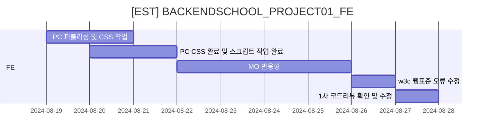
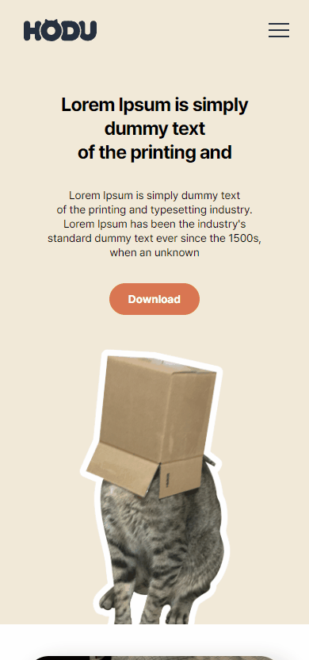
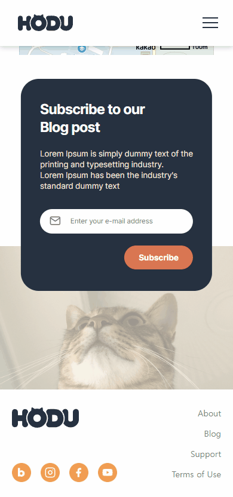

# [EST] BACKENDSCHOOL_PROJECT01_FE
## 👨‍🏫 프로젝트 목적
- 피그마 시안과 요구사항 명세를 참고하여 랜딩페이지 제작
- 시멘틱 태그로 구현하되 모바일 화면도 고려하여 과제 수행

## ⚙️개발환경 및 배포 URL
### 개발환경
- IDE : IntelliJ
- 사용 언어 : HTML, CSS, Javascript

### 배포 URL
- 배포 URL : https://goldsonge.github.io/EST_BACKENDSCHOOL_PROJECT01/

## 📌요구사항 명세
- 피그마를 참고하여 페이지 구현
  - 피그마 링크 : https://www.figma.com/design/s9RCnA6dSi3QHHeMDFHKE6/EST-오르미(BE)_HTML%2FCSS%2FJS?node-id=104924-12&t=DkHqKMa1PBxYw4n3-0
- 모바일 화면도 고려하여 페이지 구현
- 스크롤시 헤더 고정 (단, 처음에는 고정된 상태가 아님)
- 스크롤 탑 버튼 구현
  - 스크롤 탑 버튼은 스크롤시 나타남
  - 스크롤 탑 버튼은 푸터 아래로 내려가지 않음
  - 스크롤 탑 버튼을 누르면 스크롤이 최상단으로 올라감 (단, 부드럽게 올라가야 함)
- 구독하기 모달창
  - 이메일을 입력하고 subscribe 버튼을 클릭하면 모달창 노출
  - 이메일 유효성 검사를 진행 (값이 들어가지 않거나 이메일 형식이 유효하지 않으면 alert 창으로 경고 문구 노출)
  - 이메일이 잘 입력되었다면 모달창 노출.
  - 이때 모달창의 OK! I LOVE HODU 버튼을 클릭하면 form이 제출되고 모달창이 닫힘

## 💻 프로젝트 구조와 기간
### 프로젝트 구조
📦EST_BACKENDSCHOOL_PROJECT01  
┣ 📂css  
┃ ┣ 📜main.css  
┃ ┗ 📜reset.css  
┣ 📂img  
┃ ┣ 📜Logo.svg   
┃ ┣ 📜icon-blog.png  
┃ ┣ 📜icon-facebook.png  
┃ ┣ 📜icon-insta.png   
┃ ┣ 📜icon-youtube.png     
┃ ┣ 📜icon_arr_off.svg   
┃ ┣ 📜icon_arr_on.svg  
┃ ┣ 📜icon_ham_off.svg   
┃ ┣ 📜icon_ham_on.svg  
┃ ┣ 📜icon_mail.svg  
┃ ┣ 📜sec01_bg01.png   
┃ ┣ 📜sec02_img01.jpg    
┃ ┣ 📜sec03_img02.jpg  
┃ ┣ 📜sec03_img03.jpg  
┃ ┣ 📜sec03_img04.jpg  
┃ ┣ 📜sec03_img05.jpg  
┃ ┣ 📜sec03_img06.jpg  
┃ ┣ 📜sec04_img01.jpg  
┃ ┣ 📜sec05_bg01.jpg   
┃ ┣ 📜sec05_pop_bg.jpg   
┃ ┗ 📜sec05_pop_img01.png  
┣ 📂js   
┃ ┗ 📜main.js  
┣ 📜README.md  
┗ 📜index.html

### 개발 일정 (WBS)

## 💻 화면 설계
<table>
    <tbody>
        <tr>
            <td>PC main</td>
            <td>MO main</td>
        </tr>
        <tr>
            <td>
		
            </td>
            <td>
                
            </td>
        </tr>
        <tr>
            <td>PC topBtn</td>
            <td>MO hamburgerMenu</td>
        </tr>
        <tr>
            <td>
                
            </td>
            <td>
                
            </td>
        </tr>
        <tr>
            <td>PC subscribe</td>
            <td>MO subscribe</td>
        </tr>
        <tr>
            <td>
                
            </td>
            <td>
                
            </td>
        </tr>
    </tbody>
</table>

## ⏲️ 개발하며 느낀점
- 시멘트 태그를 신경 써서 이번 프로젝트의 마크업 구조를 작성함으로써 시멘트 태그에 대해 조금 더 알아보는 시간이 되어 좋았다.
- Javascript를 작성할 때 최대한 누가 봐도 알 수 있는 유지보수와 재사용률이 높은 코드로 작성하려고 노력하였는데 아직은 미숙하지만, 앞으로의 개발에서도 한 번 더 생각해 볼 수 있는 시간이 되었다.